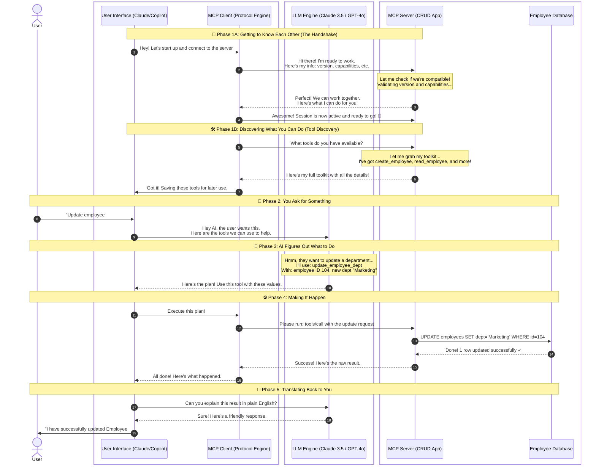

```mermaid
sequenceDiagram
    autonumber
    actor User
    box #F0F4F8 MCP Host Application
        participant UI as User Interface (Claude/Copilot)
        participant Client as MCP Client (Protocol Engine)
    end
    box #FFF4E5 Cloud AI
        participant LLM as LLM Engine (Claude 3.5 / GPT-4o)
    end
    box #E6F7FF Your Machine
        participant Server as MCP Server (CRUD App)
        participant DB as Employee Database
    end

    Note over UI, Server: 🤝 Phase 1A: Getting to Know Each Other (The Handshake)
    UI->>Client: Hey! Let's start up and connect to the server
    Client->>Server: Hi there! I'm ready to work.<br/>Here's my info: version, capabilities, etc.
    Note over Server: Let me check if we're compatible!<br/>Validating version and capabilities...
    Server-->>Client: Perfect! We can work together.<br/>Here's what I can do for you!
    Client->>Server: Awesome! Session is now active and ready to go! 🎉

    Note over UI, Server: 🛠️ Phase 1B: Discovering What You Can Do (Tool Discovery)
    Client->>Server: What tools do you have available?
    Note over Server: Let me grab my toolkit...<br/>I've got create_employee, read_employee, and more!
    Server-->>Client: Here's my full toolkit with all the details!
    Client->>UI: Got it! Saving these tools for later use.

    Note over User, DB: 💬 Phase 2: You Ask for Something
    User->>UI: "Update employee #104's department to Marketing."
    UI->>LLM: Hey AI, the user wants this.<br/>Here are the tools we can use to help.

    Note over User, DB: 🧠 Phase 3: AI Figures Out What to Do
    Note over LLM: Hmm, they want to update a department...<br/>I'll use: update_employee_dept<br/>With: employee ID 104, new dept "Marketing"
    LLM-->>UI: Here's the plan! Use this tool with these values.

    Note over User, DB: ⚙️ Phase 4: Making It Happen
    UI->>Client: Execute this plan!
    Client->>Server: Please run: tools/call with the update request
    Server->>DB: UPDATE employees SET dept='Marketing' WHERE id=104
    DB-->>Server: Done! 1 row updated successfully ✓
    Server-->>Client: Success! Here's the raw result.
    Client-->>UI: All done! Here's what happened.

    Note over User, DB: 📝 Phase 5: Translating Back to You
    UI->>LLM: Can you explain this result in plain English?
    LLM-->>UI: Sure! Here's a friendly response.
    UI->>User: "I have successfully updated Employee #104 to the Marketing department." ✨
```
