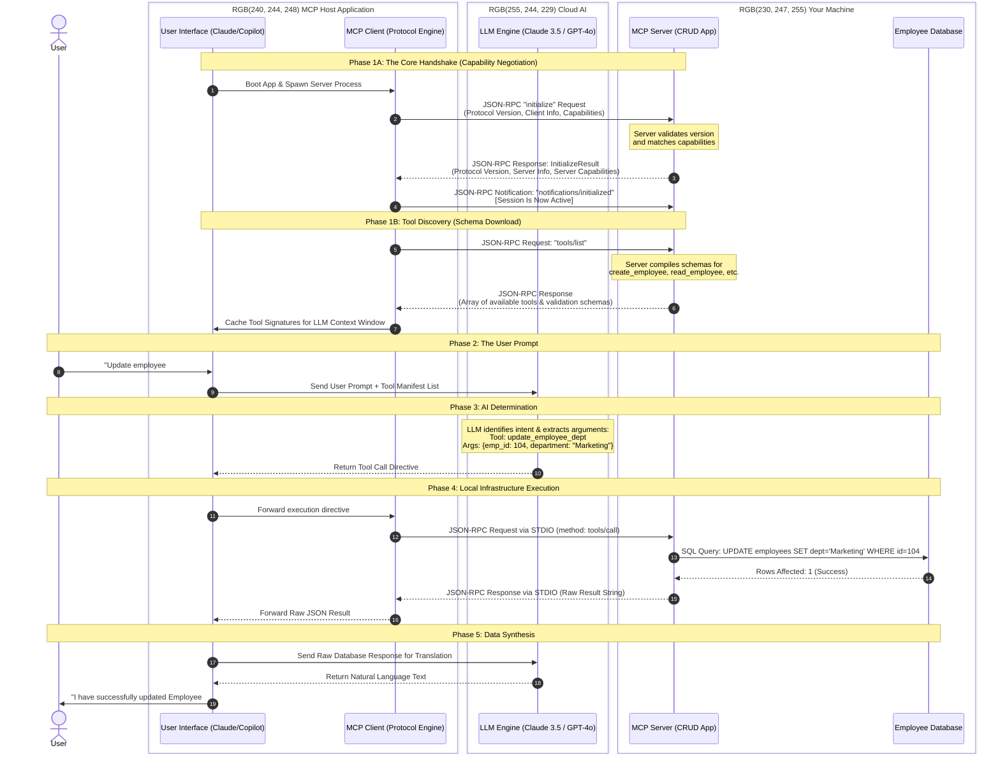

```mermaid
sequenceDiagram
    autonumber
    actor User
    box RGB(240, 244, 248) MCP Host Application
        participant UI as User Interface (Claude/Copilot)
        participant Client as MCP Client (Protocol Engine)
    end
    box RGB(255, 244, 229) Cloud AI
        participant LLM as LLM Engine (Claude 3.5 / GPT-4o)
    end
    box RGB(230, 247, 255) Your Machine
        participant Server as MCP Server (CRUD App)
        participant DB as Employee Database
    end

    Note over UI, Server: Phase 1A: The Core Handshake (Capability Negotiation)
    UI->>Client: Boot App & Spawn Server Process
    Client->>Server: JSON-RPC "initialize" Request<br/>(Protocol Version, Client Info, Capabilities)
    Note over Server: Server validates version<br/>and matches capabilities
    Server-->>Client: JSON-RPC Response: InitializeResult<br/>(Protocol Version, Server Info, Server Capabilities)
    Client->>Server: JSON-RPC Notification: "notifications/initialized"<br/>[Session Is Now Active]

    Note over UI, Server: Phase 1B: Tool Discovery (Schema Download)
    Client->>Server: JSON-RPC Request: "tools/list"
    Note over Server: Server compiles schemas for<br/>create_employee, read_employee, etc.
    Server-->>Client: JSON-RPC Response<br/>(Array of available tools & validation schemas)
    Client->>UI: Cache Tool Signatures for LLM Context Window

    Note over User, DB: Phase 2: The User Prompt
    User->>UI: "Update employee #104's department to Marketing."
    UI->>LLM: Send User Prompt + Tool Manifest List

    Note over User, DB: Phase 3: AI Determination
    Note over LLM: LLM identifies intent & extracts arguments:<br/>Tool: update_employee_dept<br/>Args: {emp_id: 104, department: "Marketing"}
    LLM-->>UI: Return Tool Call Directive

    Note over User, DB: Phase 4: Local Infrastructure Execution
    UI->>Client: Forward execution directive
    Client->>Server: JSON-RPC Request via STDIO (method: tools/call)
    Server->>DB: SQL Query: UPDATE employees SET dept='Marketing' WHERE id=104
    DB-->>Server: Rows Affected: 1 (Success)
    Server-->>Client: JSON-RPC Response via STDIO (Raw Result String)
    Client-->>UI: Forward Raw JSON Result

    Note over User, DB: Phase 5: Data Synthesis
    UI->>LLM: Send Raw Database Response for Translation
    LLM-->>UI: Return Natural Language Text
    UI->>User: "I have successfully updated Employee #104 to the Marketing department."
```
