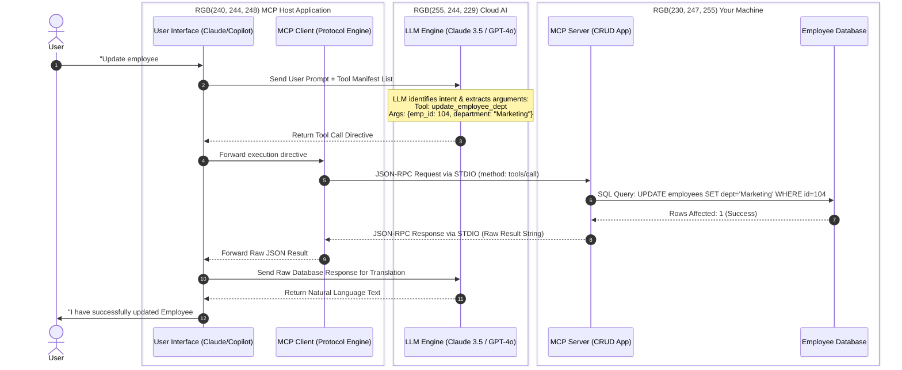

```mermaid
sequenceDiagram
    autonumber
    actor User
    box RGB(240, 244, 248) MCP Host Application
        participant UI as User Interface (Claude/Copilot)
        participant Client as MCP Client (Protocol Engine)
    end
    box RGB(255, 244, 229) Cloud AI
        participant LLM as LLM Engine (Claude 3.5 / GPT-4o)
    end
    box RGB(230, 247, 255) Your Machine
        participant Server as MCP Server (CRUD App)
        participant DB as Employee Database
    end

    %% Phase 1: The Prompt
    User->>UI: "Update employee #104's department to Marketing."
    UI->>LLM: Send User Prompt + Tool Manifest List

    %% Phase 2: AI Determination
    Note over LLM: LLM identifies intent & extracts arguments:<br/>Tool: update_employee_dept<br/>Args: {emp_id: 104, department: "Marketing"}
    LLM-->>UI: Return Tool Call Directive

    %% Phase 3: Local Infrastructure Execution
    UI->>Client: Forward execution directive
    Client->>Server: JSON-RPC Request via STDIO (method: tools/call)
    Server->>DB: SQL Query: UPDATE employees SET dept='Marketing' WHERE id=104
    DB-->>Server: Rows Affected: 1 (Success)
    Server-->>Client: JSON-RPC Response via STDIO (Raw Result String)
    Client-->>UI: Forward Raw JSON Result

    %% Phase 4: Data Synthesis
    UI->>LLM: Send Raw Database Response for Translation
    LLM-->>UI: Return Natural Language Text
    UI->>User: "I have successfully updated Employee #104 to the Marketing department."
```
